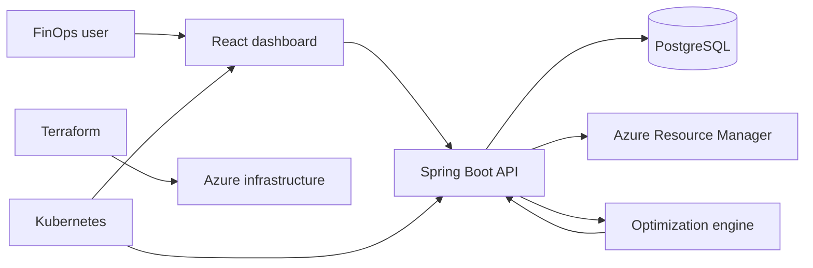

# Cloud Cost Optimizer

[](https://github.com/sunilguntupalli/cloud-cost-optimizer/actions/workflows/ci.yml)

A full-stack cloud cost optimization dashboard for discovering Azure resources, analyzing utilization, and surfacing savings opportunities across compute and storage.

## Architecture



## Stack

- Java 17 / Spring Boot 3 / Spring Data JPA
- React 18 / Vite / Recharts
- PostgreSQL 16
- Azure Resource Manager SDK (optional live discovery)
- Docker, Kubernetes, and Terraform (Azure)

## Run locally

```bash
docker compose up --build
```

Open `http://localhost:5173`. The API is at `http://localhost:8080/api/v1` (PostgreSQL is exposed on port `5433` to avoid common local conflicts).

Without Azure credentials the application seeds realistic demo recommendations. To enable Azure discovery, set `AZURE_SUBSCRIPTION_ID`, `AZURE_TENANT_ID`, `AZURE_CLIENT_ID`, and `AZURE_CLIENT_SECRET`.

Database changes are versioned with Flyway under `backend/src/main/resources/db/migration`. GitHub Actions verifies the Java tests, React production build, and both container images on every pull request.

## API surface

| Area | Endpoints |
| --- | --- |
| Dashboard | `GET /dashboard/summary`, `GET /dashboard/trends` |
| Resources | `GET /resources`, `GET /resources/{id}`, `POST /resources/discover` |
| Recommendations | `GET /recommendations`, `GET /recommendations/{id}`, `POST /recommendations/{id}/status`, `GET /recommendations/summary` |
| Reports | `GET /reports/overview`, `GET /reports/export` |
| Health | `GET /health` |

## Deploy

1. Provision foundation: `cd infra/terraform && terraform init && terraform apply`
2. Build/push images to your registry, then update image names in `infra/kubernetes/`.
3. Apply: `kubectl apply -f infra/kubernetes/`
